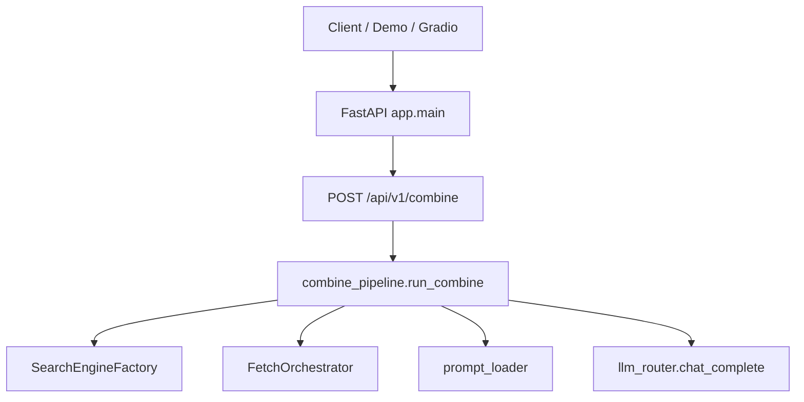

# Combine-Search 功能规格说明（SPEC）

> **版本**：与当前仓库代码对齐（2026-05）  
> **关联文档**：[总体设计.md](./总体设计.md)（架构与边界）、[README.md](../README.md)（运行说明）  
> **结论（除密钥/外网外）**：规划内的**基本功能已实现**；配好 LLM Key 与可访问的搜索引擎后即可跑通端到端。

---

## 1. 产品目标

构建一个 **Python 组合搜索 + 内容提炼 Agent**：

1. 用户给出 **检索词（query）** 与 **业务场景（scenario）**；
2. 系统在 **多搜索引擎** 上检索并抓取网页正文；
3. 按 **场景化 YAML 提示词** 组装上下文；
4. 调用 **OpenAI Chat Completions 兼容** 的大模型（OpenAI / DeepSeek / 智谱 / 通义等）；
5. 返回结构化或 Markdown 形式的 **`llm_output`**，并附带来源、耗时与错误列表。

**主入口**：`POST /api/v1/combine`  
**遗留入口**：`POST /api/catalog-agent/chat`（表单多模；带 `scenario` 时与 combine 共用提示词与 LLM 路径）

---

## 2. 功能完成度总览

| 编号 | 需求（来自总体设计 §4） | 状态 | 实现位置 |
|------|-------------------------|------|----------|
| R1 | README / Quickstart / 合规说明 | ✅ | `README.md` |
| R2 | 多搜索引擎 + 多 HTTP 抓取客户端 | ✅ | `app/services/*_service.py`、`app/tools/http_clients.py` |
| R3 | 抓取策略链、单 URL 失败不拖垮整批（combine 二次抓取） | ✅ | `fetch_orchestrator.py`、`combine_pipeline.py` |
| R4 | 多 LLM 厂商（OpenAI-compatible） | ✅ | `llm_router.py` |
| R5 | 四场景内置提示词 + 外置覆盖 | ✅ | `app/prompts/*.yaml`、`prompt_loader.py` |
| R6 | `POST /api/v1/combine` 端到端编排 | ✅ | `combine_routes.py`、`combine_pipeline.py` |
| R7 | 配置去硬编码密钥、`.env.example` | ✅ | `config.py`、`search_config.py`、`.env.example` |
| R8 | 修复 `/chat` 同步阻塞、会话清理 | ✅ | `api.py`（`asyncio.to_thread`）、`conversation.py` |
| R9 | 提示词目录 API、上传、locale | ✅ | `combine_routes.py`、`prompt_loader.py` |
| R10 | 依赖拆分 core/extra、Demo、pytest | ✅ | `requirements-*.txt`、`examples/*`、`tests/` |

**不依赖 API Key 即可验证的能力**：服务启动、健康检查、提示词目录、无效引擎校验、流水线逻辑（mock 单测）。  
**依赖 API Key + 外网的能力**：真实搜索结果、真实 `llm_output`。

---

## 3. 系统架构



### 3.1 模块职责

| 模块 | 文件 | 职责 |
|------|------|------|
| 入口 | `app/main.py` | 注册 `/api/v1`、`/api/search`、`/api/catalog-agent` |
| 组合 API | `app/routes/combine_routes.py` | health、prompts 目录/上传、combine |
| 编排 | `app/services/combine_pipeline.py` | 搜索 → 可选 refetch → 截断 → 提示词 → LLM |
| 抓取链 | `app/services/fetch_orchestrator.py` | 按工具链依次尝试单 URL |
| 提示词 | `app/services/prompt_loader.py` | 解析路径、渲染占位符、缓存、校验上传 |
| LLM | `app/services/llm_router.py` | 多厂商 `chat/completions`（httpx） |
| 搜索工厂 | `app/services/search_engine_factory.py` | bing/baidu/ddg/google/sogou/douban/so |
| 遗留对话 | `app/api/api.py` | 表单 `/chat`、文件上传、可选 scenario 路径 |

---

## 4. 核心流水线：`run_combine`

**触发**：`POST /api/v1/combine` → `combine_pipeline.run_combine`（异步；同步搜索/抓取在线程池执行）。

### 4.1 步骤

| 步骤 | 行为 | 失败处理 |
|------|------|----------|
| 1 | 按 `search_engine` + `http_tool` 获取搜索服务 | 错误写入 `errors` |
| 2 | `search_web(query, "text", links_num)` 取带正文的结果 | 同上 |
| 3 | 若拼接正文长度 &lt; `min_chars_refetch`（默认 400） | 再 `search_web(..., "link")` + `FetchOrchestrator` 按链重抓 |
| 4 | 正文截断至 `max_context_chars` | 追加 `…(truncated)` |
| 5 | `load_scenario_prompt(scenario, locale)` + `render_prompt` | `prompt_*` 前缀错误，**跳过 LLM** |
| 6 | `system_prompt_override` 覆盖 system（若有） | — |
| 7 | `chat_complete(llm_provider, messages, ...)` | `llm:` 前缀错误，`llm_output` 为空 |

### 4.2 默认环境

- `DEFAULT_SEARCH_ENGINE`：默认 `bing`
- `DEFAULT_FETCH_CHAIN`：默认 `cloudscraper,request,curl`（正文过短时的二次抓取链）
- `MAX_CONTEXT_CHARS`：默认 `12000`

### 4.3 响应字段（`CombineResponse`）

| 字段 | 类型 | 说明 |
|------|------|------|
| `llm_output` | string | 模型生成文本；提示词或 LLM 失败时为空 |
| `sources` | array | `{url, title, refetched?}` |
| `raw_excerpts` | string? | `include_raw_excerpts=true` 时返回截断后上下文 |
| `errors` | string[] | 非致命错误累积（含 `prompt_missing:`、`llm:` 等） |
| `timings` | object | `search_ms`、`search_link_ms?`、`llm_ms`、`total_ms` |
| `search_engine` | string | 实际使用的引擎 |
| `scenario` | string | 场景标识 |
| `locale` | string? | 请求中的 locale |

**HTTP 语义**：编排层业务失败（搜索弱、LLM 失败）仍多为 **HTTP 200**；客户端应结合 `errors` 与 `llm_output` 判断。参数校验失败（如非法 `search_engine`）为 **HTTP 400**。

---

## 5. HTTP API 规格

基础 URL 示例：`http://localhost:8002`

### 5.1 v1（推荐）

| 方法 | 路径 | 说明 |
|------|------|------|
| GET | `/api/v1/health` | `{"status":"ok","service":"...","api":"v1"}` |
| GET | `/api/v1/prompts/scenarios` | 查询参数 `locale` 可选 |
| POST | `/api/v1/prompts/upload` | 需 `PROMPTS_DIR` + 头 `X-Prompts-Admin-Key` |
| POST | `/api/v1/combine` | 主业务 JSON 体，见 §5.2 |

### 5.2 `POST /api/v1/combine` 请求体

```json
{
  "query": "流浪地球2 豆瓣",
  "scenario": "film",
  "search_engine": "bing",
  "links_num": 2,
  "http_tool": "cloudscraper",
  "fetch_fallback_chain": ["cloudscraper", "request"],
  "llm_provider": "openai",
  "model": null,
  "temperature": 0.3,
  "system_prompt_override": null,
  "include_raw_excerpts": false,
  "max_context_chars": 12000,
  "locale": "zh"
}
```

| 字段 | 必填 | 约束 |
|------|------|------|
| `query` | 是 | 1–2000 字符 |
| `scenario` | 否 | `film` \| `stock` \| `news` \| `product`，默认 `news` |
| `search_engine` | 否 | `bing`、`baidu`、`duckduckgo`、`google`、`sogou`、`douban`、`so` |
| `links_num` | 否 | 1–10，默认 2 |
| `http_tool` | 否 | 见各搜索引擎支持的客户端名 |
| `fetch_fallback_chain` | 否 | 覆盖 `DEFAULT_FETCH_CHAIN` |
| `llm_provider` | 否 | `openai`、`deepseek`、`zhipu`/`glm`、`dashscope`/`qwen` |
| `locale` | 否 | 如 `zh`，解析 `film.zh.yaml` |

### 5.3 `POST /api/v1/prompts/upload`

- **Content-Type**：`multipart/form-data`
- **表单**：`scenario`（必填）、`file`（YAML）、`locale`（可选）
- **请求头**：`X-Prompts-Admin-Key: <PROMPTS_ADMIN_KEY>`
- **成功**：`{"code":200,"path":"...","scenario":"...","locale":...}`

### 5.4 遗留 Catalog Chat

- **路径**：`POST /api/catalog-agent/chat`（亦挂载于 `/catalog-agent/chat`）
- **格式**：`multipart`，字段 `params`（JSON 字符串）、可选 `file`、`client_session_id`
- **params 扩展字段**（与 combine 对齐）：
  - `scenario`：有值时走 `prompt_loader` + `chat_complete`（`LLM_DEFAULT_PROVIDER`），**无 LangChain 多轮记忆**
  - `locale`、`system_prompt_override`：同 combine
- **无 `scenario`**：原 LangChain `ConversationManager` 路径（可选 `INTERNAL_AI_API_URL`）

### 5.5 搜索调试 API（遗留）

- 前缀：`/api/search/*` — 各引擎与 `fetch-*` 端点，供调试与 HTML 页面，非 combine 主路径。

---

## 6. 提示词规格

### 6.1 内置场景

| scenario | 文件 | 输出导向（摘要） |
|----------|------|------------------|
| `film` | `app/prompts/film.yaml` | 推荐语、梗概、主创、上映信息；禁止捏造 |
| `stock` | `app/prompts/stock.yaml` | 摘要、数据点、风险；非投资建议 |
| `news` | `app/prompts/news.yaml` | 时间线、起因/影响、待验证点 |
| `product` | `app/prompts/product.yaml` | 卖点、价格区间、差评主题、适用人群 |

### 6.2 YAML 结构

```yaml
system: |
  系统指令…
user: |
  用户模板，含 {{ query }}、{{ retrieved_context }}、{{ current_date }}
# 可选，不参与解析逻辑：
# version: "1.0"
# changelog: "..."
```

### 6.3 解析优先级（含 locale）

对 `scenario=film`、`locale=zh`，按序查找**第一个存在的文件**：

1. `{PROMPTS_DIR}/film.zh.yaml`
2. `{PROMPTS_DIR}/film.yaml`
3. `app/prompts/film.zh.yaml`
4. `app/prompts/film.yaml`

单次请求 `system_prompt_override` 仅覆盖 **system**；**user** 仍由模板渲染。

### 6.4 错误前缀（写入 `errors[]`）

| 前缀 | 含义 |
|------|------|
| `prompt_missing:` | 无匹配 YAML 文件 |
| `prompt_invalid:` | 缺少 `system`/`user` |
| `prompt_load:` | 其它加载异常 |
| `llm:` | 调用大模型失败（含未配置 Key） |
| `refetch {url}:` | 二次抓取单链失败 |

---

## 7. LLM 提供商规格

实现：`app/services/llm_router.chat_complete`（**httpx**，非 LangChain）。

| provider 别名 | 环境变量 Key | 默认 Base（可覆盖） |
|---------------|--------------|---------------------|
| `openai`, `chatgpt` | `OPENAI_API_KEY` | `OPENAI_API_BASE` |
| `deepseek` | `DEEPSEEK_API_KEY` | `DEEPSEEK_API_BASE` |
| `zhipu`, `glm`, `chatglm` | `ZHIPU_API_KEY` | `ZHIPU_API_BASE` |
| `dashscope`, `qwen`, `tongyi` | `DASHSCOPE_API_KEY` | `DASHSCOPE_API_BASE` |

未配置对应 Key 时抛出 `ValueError`，combine 流水线捕获后记为 `llm: ...`。

**遗留路径**：`ConversationManager` 在配置 `INTERNAL_AI_API_URL` 时使用 `InternalLLM`；否则 `OpenAICompatibleLLM` → 内部仍调用 `chat_complete`。

---

## 8. 配置与环境变量

完整占位见 [`.env.example`](../.env.example)。

| 变量 | 必填 | 说明 |
|------|------|------|
| `OPENAI_API_KEY` 等 | combine 跑 LLM 时**至少一个** | 按 `llm_provider` 选择 |
| `PROMPTS_DIR` | 上传模板时必填 | 外置提示词根目录 |
| `PROMPTS_ADMIN_KEY` | 上传时必填 | 与 `X-Prompts-Admin-Key` 一致 |
| `PROMPTS_CACHE_ENABLED` | 否 | 默认 `false`；`true` 按 mtime 缓存模板 |
| `FIRECRAWL_API_KEY` | 否 | 使用 firecrawl 客户端时需要 |
| `AGENT_PROXY_BASE` | 否 | `?url=` 代理抓取根地址 |
| `INTERNAL_AI_API_URL` | 否 | 遗留 catalog 内部网关 |

---

## 9. 依赖与运行

```bash
# 仅 API / 搜索 / combine（推荐开发）
pip install -r requirements-core.txt

# 含 torch、Gradio、Streamlit
pip install -r requirements.txt

cp .env.example .env   # 填写至少一个 LLM Key
uvicorn app.main:app --host 0.0.0.0 --port 8002
```

| 脚本 | 用途 |
|------|------|
| `examples/demo_combine.py` | curl 等价，调 `POST /api/v1/combine` |
| `examples/gradio_combine_demo.py` | 需 `requirements-extra` 中的 Gradio |

**Python**：3.9+（`scraper.py` 等使用 `from __future__ import annotations`）；推荐 3.11+ 虚拟环境。

---

## 10. 验收标准

### 10.1 自动化（无需 API Key）

```bash
pytest tests/ -q
```

当前覆盖（14 项）：

- 应用冒烟：`test_app_smoke.py`（完整 `app.main` 导入与健康、catalog）
- v1 API：`test_combine_api.py`（health、prompts、非法引擎、上传鉴权）
- 流水线：`test_combine_pipeline.py`（mock 搜索/LLM、提示词失败跳过 LLM）
- 提示词：`test_prompt_loader.py`

### 10.2 手工端到端（需 Key + 外网）

```bash
curl -s http://127.0.0.1:8002/api/v1/health
python examples/demo_combine.py
```

**通过条件**：`llm_output` 非空；`errors` 无致命 `prompt_*`；`sources` 至少有一条（视网络与反爬而定）。

---

## 11. 明确不在范围内的能力

- 保证绕过所有验证码 / 登录墙 / 商业 WAF
- 登录态站内全文（微博、知乎等）稳定抓取
- 证券级实时行情权威数据（应接持牌 API）
- CI 内对真实 Bing + 真实 OpenAI 的稳定 E2E（需密钥，未纳入仓库）
- LangChain 路径全面迁移至 OpenAI SDK v1（combine 已用 httpx）

---

## 12. 需求追溯矩阵（简表）

| 用户原始诉求 | SPEC 章节 | 代码锚点 |
|--------------|-----------|----------|
| 组合搜索 + 提炼 | §4、§5.2 | `combine_pipeline.py` |
| 多搜索引擎 | §3.1 | `*_service.py`, `search_engine_factory.py` |
| 多抓取 / 反爬工程化 | §3.1、§11 | `http_clients.py`, `fetch_orchestrator.py` |
| 多模型 | §7 | `llm_router.py` |
| 场景提示词 | §6 | `app/prompts/`, `prompt_loader.py` |
| 外置模板 / 上传 / 多语言 | §6.3、§5.3 | `prompt_loader.py`, `combine_routes.py` |
| API + Demo + 测试 | §5、§9、§10 | `main.py`, `examples/`, `tests/` |
| 文档 | — | `README.md`, `docs/总体设计.md`, **本文** |

---

## 13. Agent Skills（给其他大模型）

开发与测试约定见 **[docs/skills/README.md](skills/README.md)**（`combine-search-dev` / `combine-search-prompts` / `combine-search-testing`）。仓库入口：[AGENTS.md](../AGENTS.md)。

---

## 14. 修订记录

| 日期 | 说明 |
|------|------|
| 2026-05 | 首版 SPEC：与实现同步，标注「除密钥/外网外基本功能已完成」 |
| 2026-05 | Skill 迁至 `docs/skills/` |
