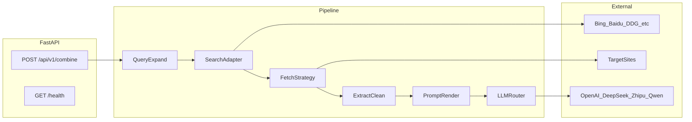
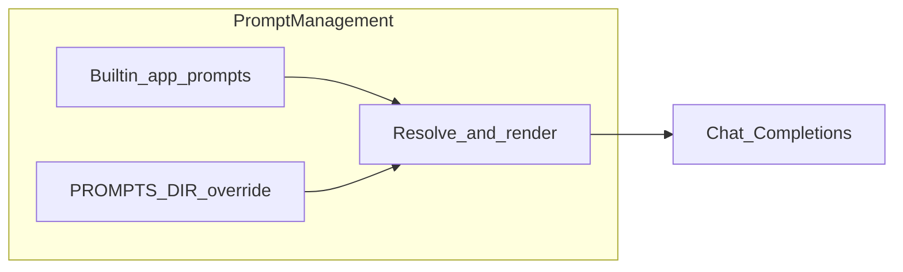

# Combine-Search 组合搜索 Agent 总体设计方案

## 1. 目标与价值主张

本项目是一个 **Python 组合搜索 + 内容提炼 Agent**：用关键词驱动 **多搜索引擎** 获取候选链接，用 **可插拔的 HTTP/浏览器抓取** 拉取正文，再按 **场景化提示词模板** 调用 **可切换的大模型**，输出推荐语、精炼总结、概要简介等结构化文本。

与 README 现状对齐并升级：从「罗列抓取端点」升级为「端到端用例 + 配置说明 + 合规声明」。

---

## 2. 现状盘点（基于代码，与实现对齐）

| 模块 | 路径 | 现状 |
|------|------|------|
| 抓取客户端层 | [http_clients.py](../app/tools/http_clients.py) | request/curl/cloudscraper/selenium/playwright/firecrawl/agent 等；Scrapy 延迟导入；Playwright `goto` 超时为毫秒；Firecrawl 依赖 `FIRECRAWL_API_KEY`；`CLOUDSCRAPER_INTERPRETER` 可配置 |
| 搜索与引擎 | [bing_service.py](../app/services/bing_service.py)、[search_engine_factory.py](../app/services/search_engine_factory.py) | 多引擎 HTML 解析取链；工厂 `DefaultSearchEngineFactory` 注册默认服务 |
| 高层爬虫封装 | [scraper.py](../app/services/scraper.py) | `WebScraper` 等；HTTP 客户端与默认搜索实例 **懒加载**，降低导入副作用 |
| 组合流水线 | [combine_pipeline.py](../app/services/combine_pipeline.py)、[fetch_orchestrator.py](../app/services/fetch_orchestrator.py) | `POST /api/v1/combine`：`asyncio.to_thread` 跑同步搜索/抓取；正文过短可按 `DEFAULT_FETCH_CHAIN` 二次抓取；**提示词缺失/无效** 时写入 `errors` 并跳过 LLM |
| LLM | [llm_router.py](../app/services/llm_router.py)、[llm.py](../app/services/llm.py) | OpenAI-compatible `chat_complete`（httpx）；可选内部网关 `INTERNAL_AI_API_URL`；旧版兼容客户端 |
| 对话编排 | [conversation.py](../app/services/conversation.py) | 内部网关或兼容 LLM；**会话表 + `clear_session`** 与 [api.py](../app/api/api.py) 中 `clear-context` 对齐 |
| HTTP API | [api.py](../app/api/api.py) | `/chat` 等对同步爬虫使用 **`asyncio.to_thread`**；`clear-context` 使用 Query `session_id` |
| 配置 | [config.py](../app/core/config.py)、[search_config.py](../app/core/search_config.py) | Firecrawl/代理/域名等以环境变量为准；`.env.example` 占位，**无仓库内硬编码密钥** |
| 提示词 | [prompt_loader.py](../app/services/prompt_loader.py)、[prompts/](../app/prompts/) | 内置 YAML + `PROMPTS_DIR` 覆盖；`GET /api/v1/prompts/scenarios` 目录 API |
| 入口 | [main.py](../app/main.py) | 搜索 `/api/search/*`；catalog `/api/catalog-agent`；**v1** `GET/POST /api/v1/*`（combine、health、prompts） |

---

## 3. 总体架构（目标态）

- **SearchAdapter**：抽象「给定 query → 返回规范化 `{title, url, snippet}` 列表」，各引擎独立实现，统一输出 schema。
- **FetchStrategy**：按 URL 域名/失败原因 **降级链**（例如 `cloudscraper` → `httpx`+重试 → `playwright`），可配置超时、并发上限、是否允许付费 Firecrawl。
- **PromptRender**：`scenario` + 内置 YAML 模板（字符串占位替换）+ 外部目录覆盖（见 **§5 提示词管理能力**）。
- **LLMRouter**：`provider` + `model` + `api_base` + `api_key`（环境变量），统一 OpenAI-compatible `chat.completions` 调用。

---

## 4. 需求分解（对应你的 1–6 条）

### 4.1 README 重写（需求 1）

- **内容结构**：项目简介与架构图、**一键端到端** Quickstart、环境变量表（搜索引擎可选、各 LLM、代理、Firecrawl）、API 列表（优先 REST JSON，保留现有 GET 兼容说明）、**合规与限制**、开发结构、测试与 Demo。
- **与代码一致**：修正当前 README 中「`app/tools`」等路径描述与实际仓库对齐；Swagger 端口与 `main` 中前缀一致。

### 4.2 爬虫修复与反爬优化（需求 2）

**工程层面（可做且应做）**

- **统一抓取入口**：`FetchOrchestrator` 封装「策略链 + 每 URL 独立结果」，避免 [app/services/base_search.py](app/services/base_search.py) 中首个 URL 失败即 `return response_error` 打断整批的问题（当前 `process_fetch` 行为不利于组合搜索）。
- **修复明显缺陷**：`PlaywrightClient` 中 `page.goto(..., timeout=self.DEFAULT_TIMEOUT * 500)` 单位与语义需核对（Playwright 为毫秒）；`CloudscraperClient` 的 `interpreter='nodejs'` 改为可配置，默认不强制 node，避免部署环境缺 node 即失败。
- **headers/会话**：对同一域名复用 `requests.Session` / cookie jar；`fake_useragent` 或轮换真实 UA 列表；请求间隔与抖动（已有部分随机 sleep，可集中到策略层）。
- **内容校验**：除 HTTP 403/429 外，增加「挑战页/空正文/过短 HTML」启发式检测后换策略或标记失败原因。
- **代码卫生**：替换 BeautifulSoup `text=True` 弃用写法；清理 [app/services/search_engine_factory.py](app/services/search_engine_factory.py) 重复 import。

**边界声明（必须写进 README / 设计文档）**

- **无法保证** 绕过所有反爬（验证码、强 WAF、登录墙、地域封禁）；生产环境应优先 **官方 API**、**授权数据源**、**Firecrawl/代理** 等合规手段。
- 使用者需遵守目标站点 **robots.txt** 与 **服务条款**；本设计不把「恶意绕过」作为目标。

### 4.3 多模型支持 DeepSeek / GLM / 千问 / ChatGPT（需求 3）

采用 **OpenAI Chat Completions 兼容协议** 统一适配（各厂商均提供或接近该形态）：

| Provider | 典型 `base_url` | 说明 |
|----------|-----------------|------|
| openai | `https://api.openai.com/v1` | ChatGPT |
| deepseek | `https://api.deepseek.com/v1` | DeepSeek |
| zhipu / glm | `https://open.bigmodel.cn/api/paas/v4` | 智谱 GLM（以官方文档为准） |
| dashscope / qwen | `https://dashscope.aliyuncs.com/compatible-mode/v1` | 千问兼容模式（以官方文档为准） |

实现要点：

- 新增 [app/services/llm/](app/services/)（或单文件 `llm_router.py`）：`LLMClient.complete(messages, model, temperature, max_tokens)`，用 **httpx** 或已有 `openai` SDK 升级路线（当前 `openai==0.27.8` 过旧，建议规划升级到 v1 SDK 或纯 httpx 以减少锁版本痛苦）。
- **移除或隔离** 硬编码 `prompt_token`；`InternalLLM` 若仍需保留，改为可选后端并通过 env 开关。
- **废弃/修复** [app/services/llm.py](app/services/llm.py) 中 URL 拼接 bug；`ConversationManager` 改为调用 `LLMRouter` 而非写死内部网关（或内部网关也走统一 HTTP 层）。

### 4.4 分场景提示词模板（需求 4）

内置 **YAML 或 Markdown 片段**（仓库内 `app/prompts/` 或 `config/prompts/`），启动时加载；支持 **外部路径覆盖**（`PROMPTS_DIR` 环境变量指向用户目录，同名文件优先）。

建议四个 `scenario` 键与输出约束：

| Scenario | 角色与约束 | 输出结构（JSON 或 Markdown 小节） |
|----------|------------|-----------------------------------|
| `film` | 基于抓取片段，区分事实与推测；禁止捏造票房 | 推荐语（20–30 字）、梗概、主创、上映/平台信息（不确定则标「待核实」） |
| `stock` | 非投资建议免责声明；数据需标注来源与时间 | 摘要、关键数据点、风险因素、信息缺口 |
| `news` | 多源交叉；时间线 | 起因/经过/影响/待验证点 |
| `product` | 电商文案倾向；客观与营销分离 | 卖点、价格区间（若文本中有）、差评主题、适用人群 |

模板中统一占位：`{{ query }}`、`{{ retrieved_context }}`、`{{ current_date }}`。实现见 [app/services/prompt_loader.py](../app/services/prompt_loader.py)。

### 4.5 完善代码使端到端可工作（需求 5）

最小闭环 API（建议新增，避免破坏旧路由）：

- `POST /api/v1/combine`：body 包含 `query`, `scenario`, `search_engine`, `links_num`, `fetch_tool` 或 `fetch_fallback_chain`, `llm_provider`, `model`, `temperature`, 可选 `system_prompt_override`。
- 返回：`sources`（url 列表）、`raw_excerpts`（可配置是否返回）、`llm_output`、`timings`、`errors[]`。

**原阻塞项（已关闭，与当前代码一致）**：

- [api.py](../app/api/api.py)：同步爬虫调用已改为 `asyncio.to_thread`（或等价线程卸载）。
- [conversation.py](../app/services/conversation.py)：`clear_session` 与会话表已与 `clear-context` 路由对齐。
- [config.py](../app/core/config.py)：`INTERNAL_AI_*` 与多厂商 LLM 相关项均为可选；本地可仅配 OpenAI 兼容密钥启动。

### 4.6 Python、多爬虫/多搜索、多模型、模板外置、API 与 DEMO（需求 6）

- **依赖瘦身**：已拆为 [requirements-core.txt](requirements-core.txt)（API/搜索/combine）与 [requirements-extra.txt](requirements-extra.txt)（torch、Gradio、Streamlit 等）；根 [requirements.txt](requirements.txt) 为二者合并。OpenAI **Python SDK** 在 core 中为 **1.x**（与 `llm_router` 所用 httpx 并存；LangChain 对话路径不依赖旧版 `openai==0.27.8`）。
- **DEMO**：① `examples/demo_combine.py`（HTTP 调 `POST /api/v1/combine`）；② `examples/gradio_combine_demo.py`（需 `pip install -r requirements-extra.txt` 中的 Gradio）。

---

## 5. 提示词管理能力（Prompt Management）

本节定义「模板从哪里来、谁优先、如何扩展」，与当前实现一致：**仓库内写死多场景默认模板 + 部署侧外部目录覆盖**，无需改代码即可换提示词。

### 5.1 目标

| 能力 | 说明 |
|------|------|
| **场景内置** | 面向 `film` / `stock` / `news` / `product` 等场景，在仓库内提供默认 YAML，保证开箱可跑、输出结构稳定。 |
| **外部设定** | 通过环境变量指定模板根目录，按场景文件名覆盖内置版本；适合运维/产品独立维护提示词，不入库。 |
| **单次覆盖** | API 层支持本次请求覆盖 system 指令（如 `system_prompt_override`），用于 A/B 或紧急纠偏，不替代文件模板机制。 |

### 5.2 模板形态与约定

- **存储格式**：YAML，每条场景一个文件，文件名 = 场景标识：`{scenario}.yaml`（如 `film.yaml`）。
- **字段**：至少包含 `system`、`user` 两段字符串，分别对应 Chat Completions 的 system / user 消息内容。
- **占位符**（渲染前由代码替换，兼容有无空格两种写法）：
  - `{{ query }}` / `{{query}}`：用户检索主题；
  - `{{ retrieved_context }}` / `{{retrieved_context}}`：拼接后的检索摘录；
  - `{{ current_date }}` / `{{current_date}}`：服务端当前日期（ISO）。
- **内置目录**：仓库内 [app/prompts/](../app/prompts/)，与代码一并版本管理，作为 **默认真理源（fallback）**。
- **解析与加载**： [app/services/prompt_loader.py](../app/services/prompt_loader.py) —— `resolve_prompt_path` → `load_scenario_prompt` → `render_prompt`。

### 5.3 解析优先级（由高到低）

1. **外部目录**：若配置了 `PROMPTS_DIR` 且存在 `{scenario}.yaml`，则 **仅用该文件**（同名覆盖内置）。
2. **内置目录**：`app/prompts/{scenario}.yaml`。
3. **单次请求**：`POST /api/v1/combine` 中若提供 `system_prompt_override`，则 **替换** 从文件读出的 `system` 内容；`user` 仍按模板渲染。

缺失文件或缺少 `system`/`user` 时应在运行时失败并计入 `errors`（前缀 `prompt_missing:` / `prompt_invalid:` / `prompt_load:`），**不调用 LLM**、不静默降级；HTTP 状态码与检索或 LLM 失败一致，仍为 **200**，由客户端根据 `errors` 与空 `llm_output` 判断。

### 5.4 与编排流水线的关系

- **Combine 流水线**：`scenario` 决定加载哪一份模板；检索正文注入 `retrieved_context` 后再调用 LLM。
- **旧版 `/catalog-agent/chat`**：若请求 JSON 中带 **`scenario`**（及可选 `locale`、`system_prompt_override`），则与 combine 相同走 **`prompt_loader` + `chat_complete`**，**不经过** LangChain 会话链（无多轮记忆）；未带 `scenario` 时仍为原 LangChain 对话路径。

### 5.5 演进能力（已实现与后续）

以下与 **§5.1–§5.4** 兼容，当前代码已部分落地：

| 项 | 实现要点 |
|----|----------|
| **多语言模板** | 文件名 `{scenario}.{locale}.yaml`（如 `film.zh.yaml`），解析顺序：外部 locale → 外部默认 → 内置 locale → 内置默认。`CombineRequest.locale`、`GET /api/v1/prompts/scenarios?locale=`、`/catalog-agent/chat` 的 `locale` 字段参与同一套逻辑。 |
| **模板缓存** | `PROMPTS_CACHE_ENABLED=true` 时按 **文件 mtime** 缓存 `load_scenario_prompt` 结果；上传接口成功后会 `invalidate_prompt_cache`。默认 `false`（改文件即生效，等价开发态热更新）。 |
| **管理上传** | `POST /api/v1/prompts/upload`（`multipart/form-data`：`scenario`、`file`、可选 `locale`），请求头 **`X-Prompts-Admin-Key`** 须等于环境变量 **`PROMPTS_ADMIN_KEY`**，且必须配置 **`PROMPTS_DIR`**。 |
| **YAML 版本字段** | 可选在 YAML 根增加 `version` / `changelog` 供运维展示；**不参与**解析优先级（仍为可选演进）。 |
| **富占位** | 若未来需要循环片段等，再引入 Jinja2 等并保持占位符向后兼容。 |

---

## 6. 配置与环境变量（建议）

- `OPENAI_API_KEY` / `DEEPSEEK_API_KEY` / `ZHIPU_API_KEY` / `DASHSCOPE_API_KEY`（按实际使用填）
- `FIRECRAWL_API_KEY`（从仓库移除默认值，仅 `.env.example` 占位）
- `AGENT_PROXY_BASE`（替代硬编码内网 URL）
- `DEFAULT_SEARCH_ENGINE`、`DEFAULT_FETCH_CHAIN`（逗号分隔）
- `PROMPTS_DIR`、`PROMPTS_CACHE_ENABLED`、`PROMPTS_ADMIN_KEY`（上传接口鉴权，见 §5.5）
- `PLAYWRIGHT_BROWSERS_PATH` / 文档说明 `playwright install`

---

## 7. 约束与边界（明确写出，避免范围失控）

**包含在本项目范围内**

- 多搜索引擎 HTML 解析与链接过滤（在 [app/core/search_config.py](app/core/search_config.py) 的 `ALLOWED_DOMAIN` 策略上可配置化）。
- 多 HTTP/浏览器抓取策略与降级、文本抽取、统一 API。
- 多 LLM 厂商切换（OpenAI-compatible）。
- **提示词管理能力**：内置多场景模板 + `PROMPTS_DIR` 外部覆盖 + 单次 `system_prompt_override`（见 §5）。
- README、`.env.example`、基础测试与 Demo。

**不包含或仅提供「集成点」**

- 稳定爬取需登录的站内搜索（微博/知乎全文等）——需要 Cookie 管理、账号体系，单独立项。
- 保证绕过商业站点所有反爬——不承诺；仅提供技术与合规建议。
- 股票/金融的实时行情权威数据——应接证券数据商 API，而非纯网页抓取。

**合规**

- 文档与默认配置强调：速率限制、尊重 robots、用户自备密钥、抓取内容版权归属用户责任。

---

## 8. 实施顺序建议（执行阶段）

1. **安全与配置**：移除硬编码密钥；`Settings` 分层必填/可选；`.env.example`。
2. **修复阻塞 Bug**：`/chat` async、LLM URL、`clear_session`、可选的 `process_fetch` 单 URL 失败不中断整批。
3. **LLMRouter + 新 combine API**：端到端打通。
4. **提示词目录 + scenario**：四场景模板与覆盖机制。
5. **抓取策略链与 Playwright/Cloudscraper 配置治理**。
6. **重写 README + CLI/Gradio Demo + 基础集成测试**。

---

## 9. 关键文件一览（执行时会重点改动）

- [app/main.py](app/main.py)：注册新 `v1` 路由
- [app/routes/combine_routes.py](app/routes/combine_routes.py)：`POST /api/v1/combine`
- [app/services/combine_pipeline.py](app/services/combine_pipeline.py)、[app/services/llm_router.py](app/services/llm_router.py)、[app/services/prompt_loader.py](app/services/prompt_loader.py)（§5）、[app/services/fetch_orchestrator.py](app/services/fetch_orchestrator.py)
- [app/prompts/](app/prompts/)：内置场景 YAML；外部目录由 `PROMPTS_DIR` 覆盖
- [app/api/api.py](app/api/api.py)：遗留 `/catalog-agent/chat` 等
- [app/tools/http_clients.py](app/tools/http_clients.py)：策略链、timeout/node 配置
- [app/core/search_config.py](app/core/search_config.py) / [app/core/config.py](app/core/config.py)：去密钥、可配置域名
- [README.md](README.md)：全文替换为与实现对齐的文档
